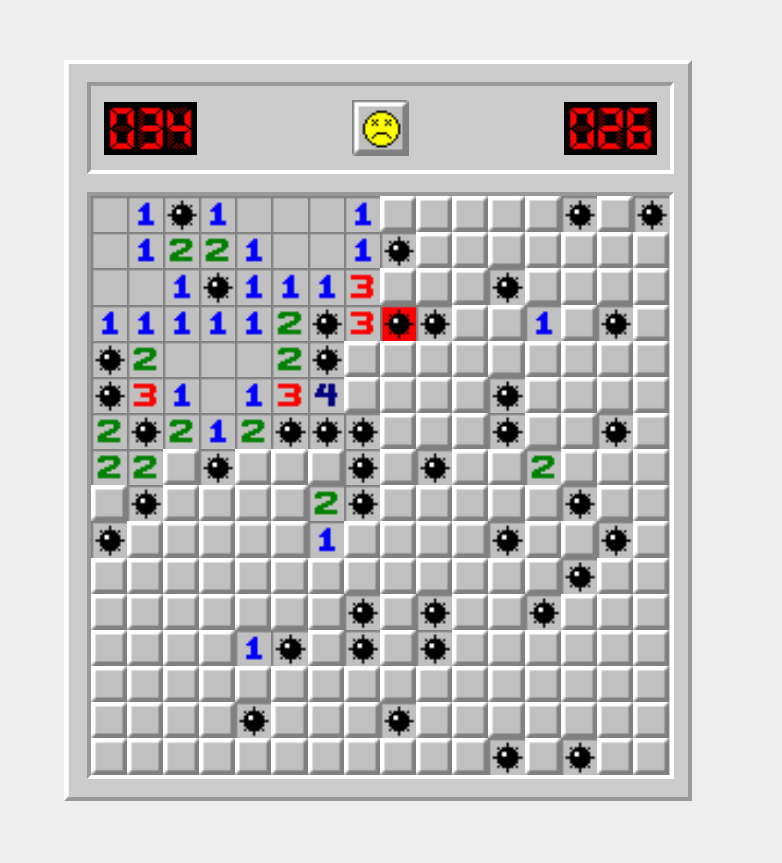

<h1 style="text-align: center">Игра Сапёр</h1>

---

## Описание проекта

Pet-проект, в котором реализована основная функциональность игры "Сапёр".

*Скриншот*

## Используемые технологии

   

## Функциональность

* поле 16*16 клеток
* таймер на 40 минут после 1го хода
* первый ход никогда не попадает на мину
* если рядом с пустым полем есть другие поля без мин поблизости, они открываются автоматически
* правая клавиша ставит флажок над полем, где предполагается мина
* клик правой клавиши по флажку ставит вопросительный знак, еще клик - выделение снимается
* клик по смайлу перезапускает игру
* испуганный смайлик - пользователь нажал на поле, но еще не отпустил кнопку мыши
* проигрыш - смайлик заменяется на грустный, раскрывается карта мин
* когда пользователь открыл все поля кроме мин, смайлик надевает солнечные очки, секундомер останавливается

*Скринкаст*

## Установка

1. Клонировать репозиторий
`git clone https://github.com/koshinva/saper.git`

2. Установить зависимости
`npm install`

3. Запустить локально на своей машине с помощью команды
`npm run start`

4. Перейти в браузер по ссылке  `http://localhost:3000/` 

## Ссылки

**Демо** версия проекта доступна по **[ссылке](https://koshinva.github.io/saper/ 'https://koshinva.github.io/saper/')**

*Задать вопрос по проекту*
